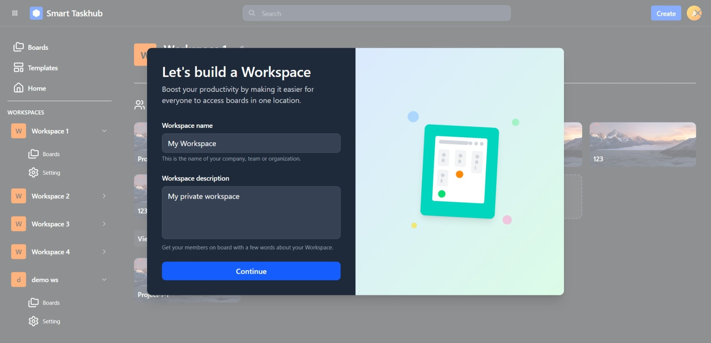
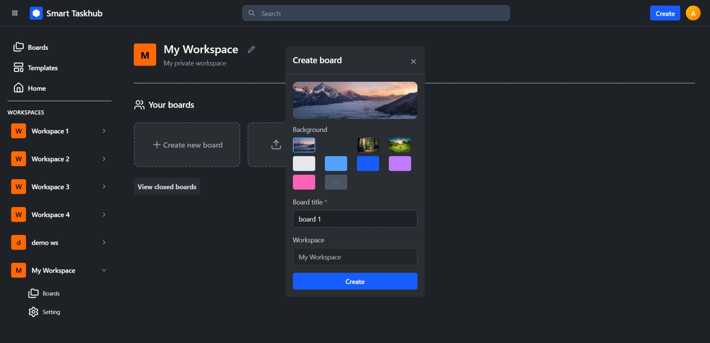
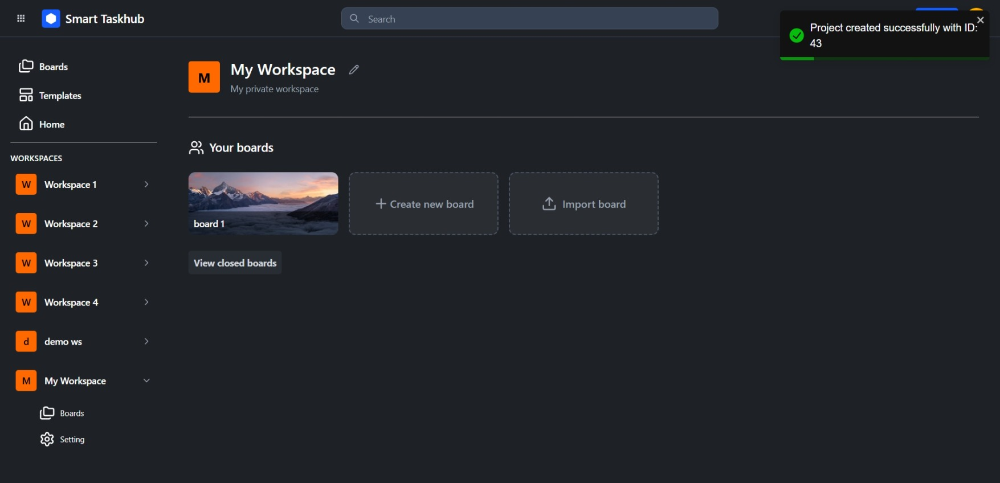
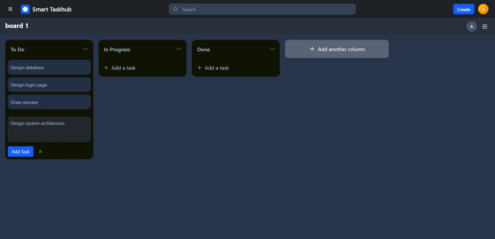
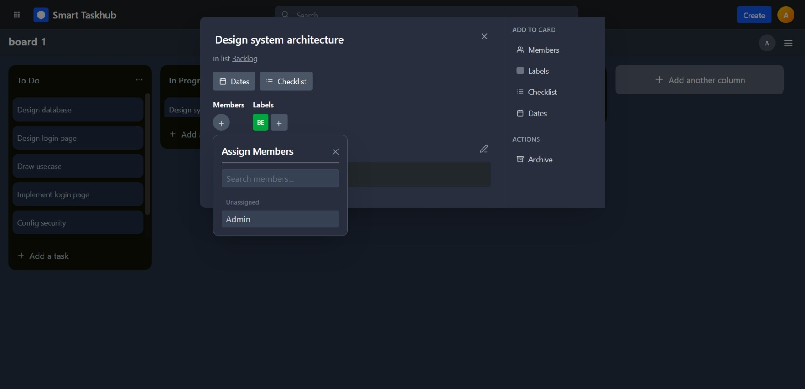
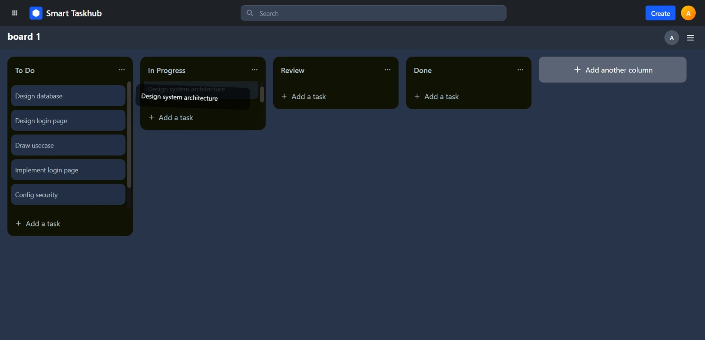
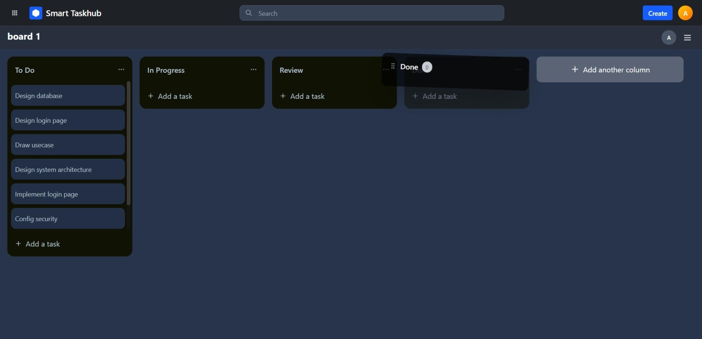
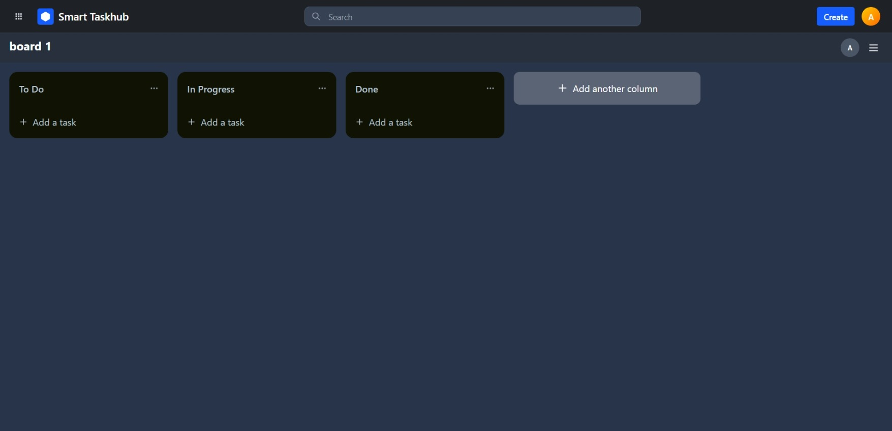
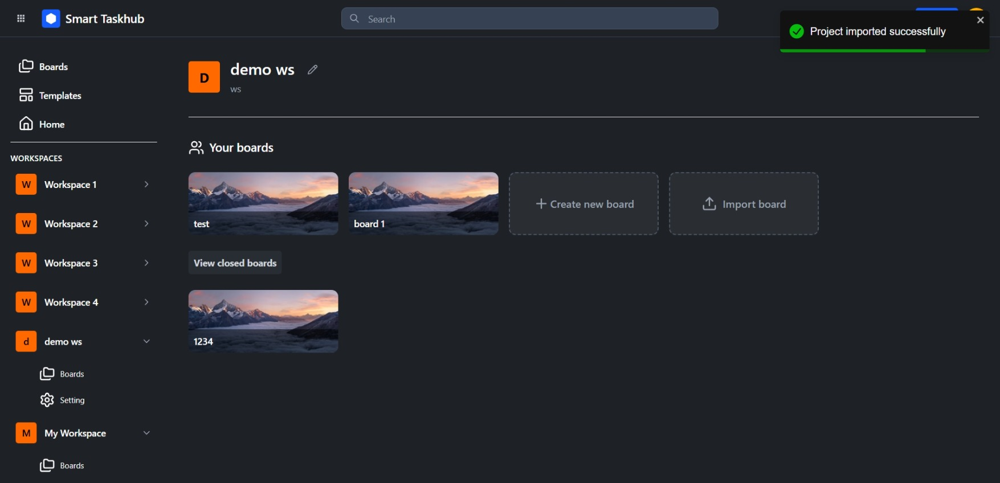
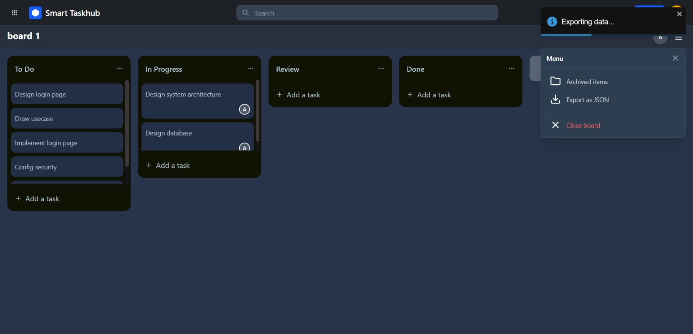

# Smart Taskhub

**Smart Taskhub** is a project management application that helps teams organize tasks, manage workflows, and collaborate effectively.

## Technologies and Frameworks
- **Frontend:** React, TypeScript, Vite, Tailwind CSS, Redux Toolkit, TanStack (React Query & Virtual), dnd-kit
- **Backend:** Play Framework (Scala), Slick, Caffeine, Akka Actors
- **Database**: PostgreSQL
- **Testing**: ScalaTest (backend)
- **CI**: Github Actions

## System Architecture

## Entity Relationship Diagram (ERD)

## Code Coverage Report
Below is a screenshot of the backend test coverage report generated with sbt-scoverage:

## Project Structure
- `frontend/` – Frontend source code (UI).
- `backend/` – Backend API server.

## How to Run
Each part has its own detailed setup guide:
- [Frontend README](./frontend/README.md)
- [Backend README](./backend/README.md)

## Screenshots
Below are some captures showcasing key features of the application.

### Workspace & Boards
| Create Workspace | Create Board | Board Created |
|------------------|--------------|----------------|
|  |  |  |

### Tasks Management
| Create Task | Assign Member to Task | Move Task |
|--------------|----------------------|------------|
|  |  |  |

### Board Operations
| Move Column | Default Board Detail |
|--------------|----------------------|
|  |  |

### Import / Export Project
| Import Project | Export Project |
|----------------|----------------|
|  |  |
